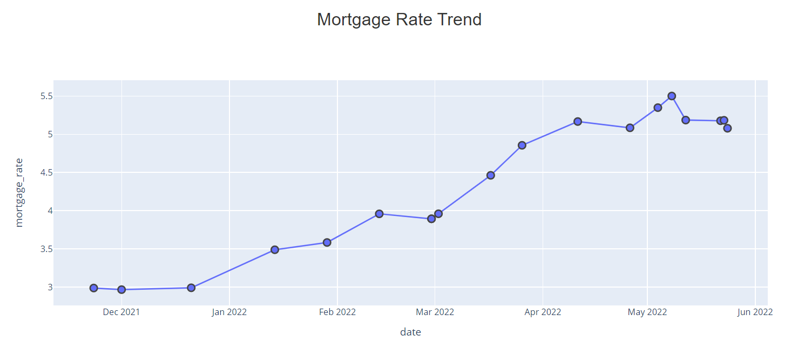

# python-webscraping-sqlite-database-flask-mortgage-rates

Mortgage rates have been increasing at an alarming pace since the beginning of 2022. I have been following them closely and watching the trends pretty much on a daily basis. I wanted to build a script which could fetch the rates from the internet and visualize them on a webpage. 

I decided to use python to accomplish this task since I have some backnground on the language.

In this demonstration, I use python to extract mortgage interest rates from a webpage (webscraping), then store the results in an sqlite database, and visualize trends on a webpage using python Flask. I used the plotly python library for visualization since it provides interactive plots which make for an improved user experience.

I scrape the mortgage rates from this website:
https://www.nerdwallet.com/mortgages/mortgage-rates

This is what the visualization looks like:

